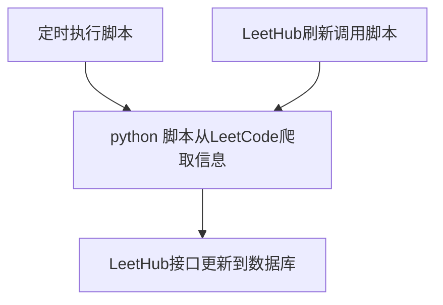
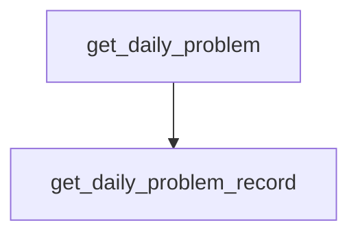

#### LeetHub需求说明

##### A. 前端

- [x] ##### 0. 用户登录注销

  - [x] ###### 0.1 用户登录

  - [x] ###### 0.2 用户注销

- [x] ##### 1. 日结

  - [x] ###### 1.0 每日一题题目展示

  - [x] ###### 1.1 每日一题完成情况展示

  - [x] ###### 1.2 当天做题计数、标签

  - [x] ###### 1.3 积分增长曲线、表

  - [x] ###### 1.4 全站排名曲线图

  - [x] ###### 1.5 全站排名表格

- [x] ##### 2. 周结

  - [x] ###### 2.1 竞赛排名曲线图、表格

- [ ] ##### 3. 月结

  - [ ] ###### 3.1 每月月报邮件

- [x] ##### 4. 题解

  - [x] ###### 4.0 已做题目展示table

    - [x] ###### 4.0.1 全部展示

    - [x] ###### 4.0.2 搜索

    - [x] ###### 4.0.3 分类展示

  - [x] ###### 4.1 题目未总结提示

  - [x] ###### 4.2 题目总结面板

    - [x] ###### 4.2.0 题目展示

    - [x] ###### 4.2.1 题解编辑

    - [x] ###### 4.2.2 题目Tag展示

    - [x] ###### 4.2.3 题目Tag添加

    - [x] ###### 4.2.4 题目Tag删除

    - [x] ###### 4.2.5 题解提交

    - [x] ###### 4.2.6 别名

- [x] ##### 5. 已做题目标签分类

  - [x] ###### 5.1 标签管理

    - [x] ###### 5.1.1 增

    - [x] ###### 5.1.2 删

    - [x] ###### 5.1.3 改

    - [x] ###### 5.1.4 查

- [x] ##### 6. 个人信息维护

- [x] ##### 7. 经验总结面板

##### B. 后端

- [x] ##### 0. 用户登录注销

  - [x] ###### 0.1 用户登录

    - [x] ###### 0.1.1 用户查询接口

  - [x] ###### 0.2 用户注销

  - [x] ###### 0.3 用户拦截器

- [x] ##### 1. 日结

  - [x] ###### 1.0 每日一题题目展示

    - [x] ###### 1.0.1 每日一题爬虫

    - [x] ###### 1.0.2 数据持久化接口

  - [x] ###### 1.1 每日一题完成情况展示

    - [x] ###### 1.1.1 爬虫

    - [x] ###### 1.1.2 数据持久化接口

  - [x] ###### 1.2 当天做题计数、标签

  - [x] ###### 1.3 积分增长曲线图、表

  - [x] ###### 1.4 全站排名曲线图

  - [x] ###### 1.5 全站排名表格

- [x] ##### 2. 周结

  - [x] ###### 2.1 竞赛排名曲线图、表格

- [ ] ##### 3. 月结

  - [ ] ###### 3.1 每月月报邮件，已刷题目按难易程度计数

- [x] ##### 4. 题解

  - [x] ###### 4.0 已做题目展示table

    - [x] ###### 4.0.1 全部展示

    - [x] ###### 4.0.2 搜索

    - [x] ###### 4.0.3 分类展示

  - [x] ###### 4.1 题目未总结提示

  - [x] ###### 4.2 题目总结面板

    - [x] ###### 4.2.0 题目展示

    - [x] ###### 4.2.1 题解编辑

    - [x] ###### 4.2.2 题目Tag展示

    - [x] ###### 4.2.3 题目Tag添加

    - [x] ###### 4.2.4 题目Tag删除

    - [x] ###### 4.2.5 题解提交

    - [x] ###### 4.2.6 别名

- [x] ##### 5. 已做题目标签分类

  - [x] ###### 5.1 标签管理

    - [x] ###### 5.1.1 增

    - [x] ###### 5.1.2 删

    - [x] ###### 5.1.3 改

    - [x] ###### 5.1.4 查

- [x] ##### 6. 个人信息维护

- [x] ##### 7. 经验总结面板

#### 开发经验

##### 1. 用户登录功能 /login

> 用户通过输入用户名和密码进行登录。

a. 用户名不存在或者密码错误，返回提示，Model

b. session未过期无需重新登录，HttpSession

c. 登录成功跳转控制台页面，在Session中加入User信息

##### 2. 用户注销功能 /logout

> 用户退出，Session不在维护用户信息。

a. 将Session中用户信息删除，将Session注销，重定向到登录页面

##### 3. 用户拦截器 UserInterceptor

> 对不登录无法访问的url进行拦截，返回登录界面进行登录。

##### 4. LeetCode脚本跟后端工作关系

##### 5. 脚本执行顺序

##### * 用户登录注销控制流程梳理

1. login 的get方法返回 登陆界面，判断session中是否有user，有重定向到index界面，无返回登录界面
2. login post请求 获取前端用户名密码信息 判断用户合法性，合法重定向到index界面，不合法携带错误信息转发登陆界面
3. Interceptor控制在没有登录时只能访问login和register界面，其他情况转发到login界面
